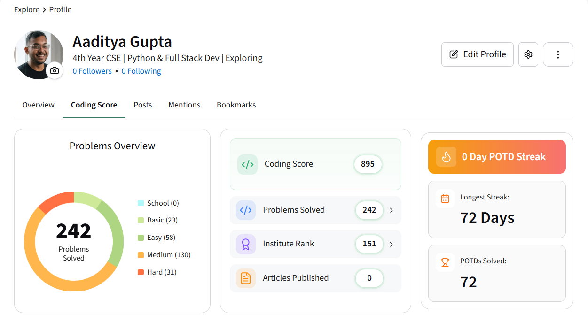

# DSA-GeeksforGeeks
Data structures and algorithms solutions from GeeksforGeeks in Python 3.

# 🚀 My DSA Journey on GeeksforGeeks

### *"Consistency beats intensity."*

---

## 🧠 The Story So Far

Numbers built one solve at a time — not overnight, not by chance. This repo is the next chapter: back to fundamentals, structured and public, as I sharpen what I already know and close the gaps that remain.

  

---

## 📊 Snapshot Before This Repo

| 🧩 Metric | 📈 Value |
|:---|:---:|
| Problems Solved | **242** |
| Coding Score | **895** |
| Institute Rank | **#151** |
| Longest Streak | **72 Days** |
| POTDs Solved | **72** |

### 🎯 Difficulty Breakdown

- 🟢 **Basic** — 23 &nbsp; `██████░░░░░░░░░░░░░░░░░░░░░░░░`
- 🟩 **Easy** — 58 &nbsp; `████████████████░░░░░░░░░░░░░░`
- 🟠 **Medium** — 130 &nbsp; `█████████████████████████████░`
- 🔴 **Hard** — 31 &nbsp; `█████████░░░░░░░░░░░░░░░░░░░░░`

---

## 📌 Why This Repo Exists

🔍 Click to see my motivation

 

- 🎯 To track **consistent, honest progress** — one problem at a time
- 🔁 To revisit fundamentals with a **stronger, structured** approach
- 📖 To build a **public record of discipline**, not just difficulty tags
- 📢 To turn practice into something **measurable and shareable**
- 🧗 To prove that growth compounds — slowly, then all at once

🛠️ What you'll find in this repo

 

- ✅ Topic-wise solved problems (Arrays, Strings, Trees, Graphs, DP, etc.)
- 📝 Clean, well-commented solutions
- 🧩 Notes on approach & complexity for tricky problems
- 📅 Regular commits reflecting real daily practice

---

## 🌱 Roadmap

- [x] Solve 242+ problems (pre-repo)
- [x] Set up structured practice repo
- [ ] Rebuild fundamentals topic-by-topic
- [ ] Cross 400+ problems milestone
- [ ] Improve Institute Rank into Top 100
- [ ] Start solving Hard-level problems consistently

---

### 💬 Final Note

*Every problem solved here is a small proof of consistency.*
*242 problems, a 72-day streak, and a rank of 151 — not because it was easy, but because I kept showing up.*

**This repo continues that habit, one solution at a time. 🚀**

⭐ *If this journey resonates with you, feel free to star this repo and follow along.*

